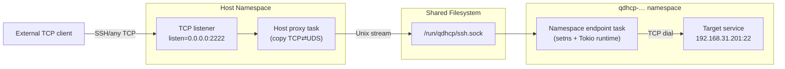

# Port Forwarder

This project provides a single Rust binary that bridges TCP clients outside of an OpenStack-style host into processes running inside Linux network namespaces by combining TCP and Unix Domain Socket (UDS) forwarding. The goal is to replace adhoc `socat` command lines with a supervised, configurable service that can run multiple forwarders at once while safely managing the lifecycle of the UDS files.

## High-Level Architecture

The forwarder binary supervises a list of **forward tasks** described via CLI flags or a TOML configuration file. Each task looks like:

- `listen`: optional TCP address (e.g. `0.0.0.0:2222`). When set, the process listens on the host and accepts external connections.
- `namespace` or `setns_path`: optional network namespace name or an absolute `/var/run/netns/<ns>` path. When provided, the task enters that namespace via `setns()` before binding a Unix socket.
- `uds`: Unix socket path used for host/namespace communication.
- `target`: final TCP address inside the namespace (e.g. `192.168.31.201:22`). Each Unix client gets its own TCP connection to this target.

Depending on which fields are populated, the binary can act as:

1. **Namespace endpoint** – enter the namespace, expose a UDS, and connect to the VM target for each inbound UDS session.
2. **Host proxy** – listen on a host TCP port, dial a UDS, and stream bytes to the namespace endpoint.
3. **Combined pipeline** – perform both actions in one task if you want the binary to enter the namespace and export a TCP listener while still running on the host (useful for testing).

All data movement is handled by `tokio::io::copy_bidirectional`, giving full-duplex forwarding similar to `socat`.

## Data Flow Diagram



## CLI Design

The binary uses `clap` for structured arguments:

```
pfwd --config forward.toml \
  --forward listen=0.0.0.0:2222,uds=/run/qdhcp/ssh.sock \
  --forward namespace=qdhcp-27a7...,uds=/run/qdhcp/ssh.sock,target=192.168.31.201:22
```

Key options:

- `--config <PATH>`: load defaults from TOML (optional).
- `--forward key=value`: repeatable and compatible with config entries. Keys mirror TOML fields (`listen`, `namespace`, `uds`, `target`, `mode`, `owner`, `backlog`, `label`).
- Flags override file values so operators can hot-fix without editing files.

## Configuration Schema

```toml
[defaults]
log_level = "info"
mode = 384            # octal 0o600 for the UDS
owner = "root:root"
uds_dir = "/run/qdhcp"

[[forward]]
namespace = "qdhcp-27a7..."
uds = "/run/qdhcp/ssh.sock"
target = "192.168.31.201:22"

[[forward]]
listen = "0.0.0.0:2222"
uds = "/run/qdhcp/ssh.sock"
```

Each `forward` table maps to one async task. Validation rules:

- `uds` is mandatory.
- At least one of `listen` or `namespace` must be set.
- `target` required when acting inside a namespace (because the agent must know where to dial).

## UDS Lifecycle Handling

- **Parent directories:** Ensure `std::fs::create_dir_all` for the parent path and apply desired permissions.
- **Stale sockets:** If the UDS path exists, `lstat`. If it is a socket, unlink before binding; otherwise abort with a clear error.
- **Ownership/mode:** After binding, use `nix::unistd::fchown`/`fchmod` on the listener fd to guarantee the requested UID/GID/mode even with different `umask` settings.
- **Cleanup:** Install a guard that removes the socket on graceful shutdown (`SIGINT`, `SIGTERM`) or abnormal drop.
- **Health checks:** The TCP-side task retries UDS connections with capped exponential backoff when `ENOENT` is returned, logging actionable messages.

## Runtime Flow

1. Parse config and CLI; build a vector of `ForwardSpec` structs.
2. For each spec, spawn an async task:
   - If `namespace` provided, call `setns()` (via `nix::sched::setns`) before opening sockets.
   - If `listen` provided, bind a `TcpListener`, accept clients, connect to `uds`, and shuttle bytes.
   - Always log per-session UUIDs for traceability.
3. Hook `tokio::signal::ctrl_c` to trigger a graceful drain and cleanup.

## Network Namespace Behavior

- The binary is single-process. Each `ForwardSpec` that combines `listen` with `namespace`/`setns_path` launches two tasks inside the same process: the host proxy task keeps running in the root namespace, while the namespace endpoint task runs on a dedicated blocking thread that calls `setns()` before starting its own Tokio runtime.
- `setns()` only affects the calling thread, so the root namespace remains available for other specs and for host-level logging/control. You do **not** need two binaries; one invocation can service both ends so long as the UDS path is visible to both namespaces.
- `ip netns identify <pid>` may print nothing because the main thread never leaves the root namespace. Inspect per-thread namespaces instead:

  ```bash
  pid=$(pgrep pfwd)
  for task in /proc/$pid/task/*; do
      tid=${task##*/}
      echo "tid=$tid $(readlink "$task/ns/net")"
  done
  ```

  Threads reporting `net:[4026531993]` (example inode) remain in the root namespace; the namespace worker shows a different inode such as `net:[4026532851]`.

- To map that inode back to an `ip netns` name, compare with the symlink behind `/var/run/netns/<name>`:

  ```bash
  readlink /var/run/netns/qdhcp-27a7862a-e1f6-4520-ac9e-061bb8b649c4
  ```

  When the inode matches the one printed for the worker thread, you know the task entered that namespace successfully.

- `lsns -t net` gives a system-wide view of namespace inodes and the PIDs bound to them. This is helpful when validating that only the expected `pfwd` thread joined a given namespace.
