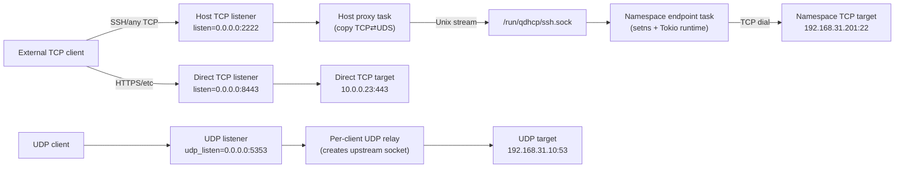

# Port Forwarder

This project provides a single Rust binary that bridges TCP clients outside of an OpenStack-style host into processes running inside Linux network namespaces by combining TCP and Unix Domain Socket (UDS) forwarding. It also supports pure TCP→TCP and UDP→UDP proxying so you can centralize all dataplane forwarding inside one supervisor. The goal is to replace adhoc `socat` command lines with a supervised, configurable service that can run multiple forwarders at once while safely managing the lifecycle of the UDS files.

## High-Level Architecture

The forwarder binary supervises a list of **forward tasks** described via CLI flags or a TOML configuration file. Each task looks like:

- `listen`: optional TCP address (e.g. `0.0.0.0:2222`). When set, the process listens on the host and accepts external connections. If `uds` is also provided we bridge into a namespace via UDS; otherwise, if `target` is set we build a direct TCP proxy.
- `udp_listen`: optional UDP address for stateless forwarding (e.g. `0.0.0.0:5353`).
- `namespace` or `setns_path`: optional network namespace name or an absolute `/var/run/netns/<ns>` path. When provided, the task enters that namespace via `setns()` before binding a Unix socket.
- `uds`: Unix socket path used for host/namespace communication.
- `target`: final TCP address (inside the namespace for UDS bridging or on the host for TCP proxies). Each client gets its own TCP connection to this target.
- `udp_target`: destination `host:port` for UDP proxies. Each client receives its own relay socket with idle eviction.

Depending on which fields are populated, the binary can act as:

1. **Namespace endpoint** – enter the namespace, expose a UDS, and connect to the VM target for each inbound UDS session.
2. **Host proxy** – listen on a host TCP port, dial a UDS, and stream bytes to the namespace endpoint.
3. **Combined pipeline** – perform both actions in one task if you want the binary to enter the namespace and export a TCP listener while still running on the host (useful for testing).

All data movement is handled by `tokio::io::copy_bidirectional`, giving full-duplex forwarding similar to `socat`.

## Data Flow Diagram



## Proxy Modes

- **UDS bridge (default)** – set `namespace`/`setns_path` + `uds` + `target` (and optionally `listen`). This is the classic host ⇄ namespace workflow documented above.
- **Direct TCP proxy** – set `listen` + `target` without `uds`. Each spec spawns a pure TCP listener on the host that dials the `target` endpoint and shuttles bytes with zero Unix sockets involved.
- **Direct UDP proxy** – set `udp_listen` + `udp_target` (and optionally `udp_idle_timeout`). The proxy allocates one upstream socket per client, forwards datagrams bidirectionally, and reclaims idle sessions automatically.

All three modes can run simultaneously in a single `pfwd` process, letting you describe your entire dataplane from one config file.

## CLI Design

The binary uses `clap` for structured arguments:

```
pfwd --config forward.toml \
  --forward listen=0.0.0.0:2222,uds=/run/qdhcp/ssh.sock \
  --forward namespace=qdhcp-27a7...,uds=/run/qdhcp/ssh.sock,target=192.168.31.201:22 \
  --forward listen=0.0.0.0:8443,target=10.0.0.23:443 \
  --forward udp_listen=0.0.0.0:5353,udp_target=192.168.31.10:53,udp_idle_timeout=600
```

Key options:

- `--config <PATH>`: load defaults from TOML (optional).
- `--forward key=value`: repeatable and compatible with config entries. Keys mirror TOML fields (`listen`, `udp_listen`, `namespace`, `uds`, `target`, `udp_target`, `mode`, `owner`, `backlog`, `label`, `udp_idle_timeout`).
- Flags override file values so operators can hot-fix without editing files.

## Configuration Schema

```toml
[defaults]
log_level = "info"
mode = 384            # octal 0o600 for the UDS
owner = "root:root"
uds_dir = "/run/qdhcp"
udp_idle_timeout_secs = 600

[[forward]]
namespace = "qdhcp-27a7..."
uds = "/run/qdhcp/ssh.sock"
target = "192.168.31.201:22"

[[forward]]
listen = "0.0.0.0:2222"
uds = "/run/qdhcp/ssh.sock"

[[forward]]
listen = "0.0.0.0:8443"
target = "10.0.0.23:443"

[[forward]]
udp_listen = "0.0.0.0:5353"
udp_target = "192.168.31.10:53"
```

Each `forward` table maps to one async task. Validation rules:

- `uds` is mandatory whenever the spec references a namespace endpoint or a host-side UDS proxy.
- `listen` may be paired with `uds` (host⇄UDS) or `target` (direct TCP). Providing `listen` without either will be rejected.
- `target` is required when acting inside a namespace or when running a direct TCP proxy.
- `udp_listen` requires `udp_target` (and vice versa). You can override idle eviction with `udp_idle_timeout_secs` (seconds, must be > 0).

## UDS Lifecycle Handling

- **Parent directories:** Ensure `std::fs::create_dir_all` for the parent path and apply desired permissions.
- **Stale sockets:** If the UDS path exists, `lstat`. If it is a socket, unlink before binding; otherwise abort with a clear error.
- **Ownership/mode:** After binding, use `nix::unistd::fchown`/`fchmod` on the listener fd to guarantee the requested UID/GID/mode even with different `umask` settings.
- **Cleanup:** Install a guard that removes the socket on graceful shutdown (`SIGINT`, `SIGTERM`) or abnormal drop.
- **Health checks:** The TCP-side task retries UDS connections with capped exponential backoff when `ENOENT` is returned, logging actionable messages.

## Runtime Flow

1. Parse config and CLI; build a vector of `ForwardSpec` structs.
2. For each spec, spawn an async task:
   - If `namespace` provided, call `setns()` (via `nix::sched::setns`) before opening sockets.
   - If `listen` provided with `uds`, bind a `TcpListener`, accept clients, connect to `uds`, and shuttle bytes.
   - If `listen` provided without `uds`, run a pure TCP proxy that dials `target` directly.
   - If `udp_listen` provided, bind a `UdpSocket`, maintain per-client relay sockets to `udp_target`, and reap idle sessions based on `udp_idle_timeout`.
   - Always log per-session UUIDs for traceability.
3. Hook `tokio::signal::ctrl_c` to trigger a graceful drain and cleanup.

## Network Namespace Behavior

- The binary is single-process. Each `ForwardSpec` that combines `listen` with `namespace`/`setns_path` launches two tasks inside the same process: the host proxy task keeps running in the root namespace, while the namespace endpoint task runs on a dedicated blocking thread that calls `setns()` before starting its own Tokio runtime.
- `setns()` only affects the calling thread, so the root namespace remains available for other specs and for host-level logging/control. You do **not** need two binaries; one invocation can service both ends so long as the UDS path is visible to both namespaces.
- `ip netns identify <pid>` may print nothing because the main thread never leaves the root namespace. Inspect per-thread namespaces instead:

  ```bash
  pid=$(pgrep pfwd)
  for task in /proc/$pid/task/*; do
      tid=${task##*/}
      echo "tid=$tid $(readlink "$task/ns/net")"
  done
  ```

  Threads reporting `net:[4026531993]` (example inode) remain in the root namespace; the namespace worker shows a different inode such as `net:[4026532851]`.

- To map that inode back to an `ip netns` name, compare with the symlink behind `/var/run/netns/<name>`:

  ```bash
  readlink /var/run/netns/qdhcp-27a7862a-e1f6-4520-ac9e-061bb8b649c4
  ```

  When the inode matches the one printed for the worker thread, you know the task entered that namespace successfully.

- `lsns -t net` gives a system-wide view of namespace inodes and the PIDs bound to them. This is helpful when validating that only the expected `pfwd` thread joined a given namespace.
- Direct TCP/UDP proxy specs never call `setns`, so they stay entirely in the root namespace and coexist safely with the namespace tasks described above.
